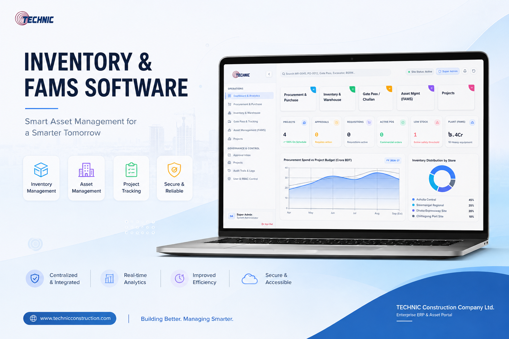
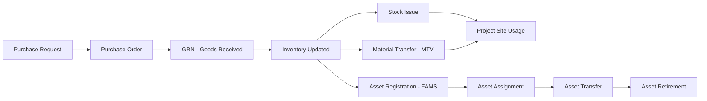

<div align="center">


# Inventory & FAMS Software
### Smart Inventory & Fixed Asset Management for Technic Construction LTD


<br/>


<a href="https://technic-fams.netlify.app/">
  
</a>
<a href="https://github.com/Joy5691/Inventory-FAMS-Software">
  
</a>

<br/><br/>


</div>

## 📌 Overview

**Inventory & FAMS Software** is a full-scale web application built for **Technic Construction LTD** to digitize and streamline how the company manages **construction site inventory** and **fixed assets** — from procurement to retirement. It replaces manual, paper-based tracking with a centralized, role-based digital system covering the *entire material and asset lifecycle*: Purchase Requests → Purchase Orders → GRN (Goods Received Note) → Stock Issue → Material Transfer (MTV) → Challans → Asset Registration → Asset Lifecycle → Reports.

The system is designed around how a **real construction company** operates — multiple active project sites, shared inventory pools, inter-project transfers, and full audit trails for every asset and material movement.

<div align="center">

<br/>
<sub><i>Official project poster — Inventory & FAMS Software</i></sub>
</div>

<br/>

## ✨ Key Features

<table>
<tr>
<td width="50%" valign="top">

### 📦 Inventory Management
- Centralized, real-time material stock tracking
- Multi-project inventory allocation
- Low-stock and reorder alerts
- Material Transfer Voucher (MTV) between projects
- Stock issue & consumption logs

### 🧾 Procurement Workflow
- Purchase Request → Purchase Order pipeline
- Multi-level PO approval flow
- Goods Received Note (GRN) posting
- Auto-updated inventory on GRN confirmation
- Vendor & challan tracking

</td>
<td width="50%" valign="top">

### 🏗️ Fixed Asset Management (FAMS)
- Full asset lifecycle: Register → Assign → Transfer → Retire
- Asset cards with complete history
- Project-wise asset allocation
- Depreciation-ready asset records

### 📊 Reports & Dashboard
- Live dashboard with key operational metrics
- Auto-generated PDF reports (GRN, PO, FAMS)
- Printable challans & vouchers
- Role-based secure login

</td>
</tr>
</table>

## 🖥️ Live Preview

<div align="center">

**🔗 Hosted App:** [technic-fams.netlify.app](https://technic-fams.netlify.app/)
**💻 Source Code:** [github.com/Joy5691/Inventory-FAMS-Software](https://github.com/Joy5691/Inventory-FAMS-Software)

</div>

## 🧩 System Workflow



## 🛠️ Tech Stack

<div align="center">


</div>

| Layer | Technology |
|---|---|
| **Frontend** | React + TypeScript |
| **Build Tool** | Vite |
| **Styling** | Custom CSS / Component-based UI |
| **AI Layer** | Gemini API |
| **Deployment** | Netlify |
| **Version Control** | Git & GitHub |

## 🚀 Getting Started

Clone the project and run it locally in a few steps:

```bash
# 1. Clone the repository
git clone https://github.com/Joy5691/Inventory-FAMS-Software.git

# 2. Navigate into the project directory
cd Inventory-FAMS-Software

# 3. Install dependencies
npm install

# 4. Set your Gemini API key
# Create/edit .env.local and add:
# GEMINI_API_KEY=your_api_key_here

# 5. Run the development server
npm run dev
```

The app will now be running locally — check your terminal for the local URL.

## 📂 File Structure

```
Inventory-FAMS-Software/
├── public/ # Static assets
├── src/ # Application source code
│ ├── components/ # UI components
│ ├── pages/ # App pages / modules (Inventory, FAMS, PO, GRN, MTV...)
│ └── context/ # App state & context management
├── index.html
├── package.json
├── metadata.json
├── netlify.toml
└── README.md
```


## 🗺️ Roadmap

- [x] Core Inventory Module
- [x] Fixed Asset Management (FAMS)
- [x] Procurement & GRN Workflow
- [x] PDF Report Generation
- [ ] Role-based multi-user permissions
- [ ] Mobile-responsive field app
- [ ] Barcode / QR asset tagging

## 👨‍💻 Developer

<div align="center">


### **Khalid Mahmud Joy**
*Computer Science & Engineering | AI • Computer Vision • Full-Stack Development*

Developed for **Technic Construction LTD** as a demo Inventory & Fixed Asset Management System.

[](https://github.com/Joy5691)

</div>

<div align="center">
<sub>© 2026 Technic Construction LTD — Built with ❤️ by Khalid Mahmud Joy</sub>
</div>
